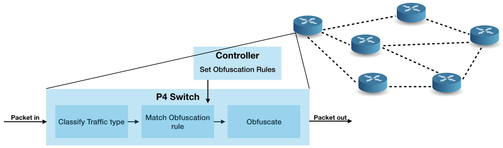
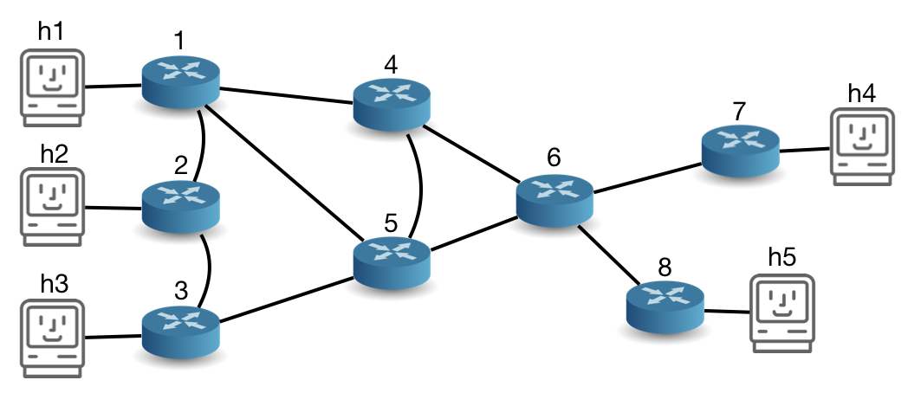

# Network Performance Obfuscation using P4
<pre>
**content of this README**
├── Summary
├── Getting started
|           ├── Needed Preinstalls
|           └── Network
├── Apply obsufcation and test them
|           ├── Obfuscate packet loss
|           ├── Obfuscate latency
|                     ├── Ping
|                     ├── Traceroute
|           ├── Obfuscate Throughput
</pre>

## Summary
In this thesis, we designed and implemented a framework to obfuscate network performance
properties. The properties considered are latency, packet loss and bandwidth. By using P4,
we were able to worsen all properties directly on the data plane. Our obfuscation controller
calculates  and  sets  all  obfuscation  rules  on  the  responsible  edge  switch.  Each  edge  switch
contains all rules for IP sources that use it as an entry point. A rule matches on the source and
destination IP range and traffic type. A packet entering the network will first be classified, then
matched with existing obfuscation rules and obfuscated respectively. To increase the packet loss
rate, we use a pseudo random number generator and drop the packet if the number drawn is
below our rate. The latency is increased by source routing the packet, based on a precalculated
path. Bandwidth throttling is done by using a Meter with the obfuscated rate as Information Rate,
a Peak Burst Size of 44 packets and a Committed Burst Size of 44 Packet. The evaluation of
our framework shows that performance properties can be worsened to reach specified values.

## Getting Started

These instructions will get the network up and running.

### Preinstalls
For _p4-utils_ you ether need to use my fork at https://github.com/Matstah/p4-utils or add the following function in the NetworkGraph() class under  _p4-utils/p4utils/utils/topology.py_ :

<pre>
def get_all_simple_paths_between_nodes(self, node1, node2, count=None):
"""Compute all simple paths between two nodes."""
paths = nx.all_simple_paths(self, node1, node2, count)
paths = [tuple(x) for x in paths]
return paths
</pre>

Also all code is run in the same way and using the same virtual machine as used in the https://github.com/nsg-ethz/p4-learning course.

### Network
The network we provide for testing our performance obfuscation looks like the following:

Being in the _Project_ folder, start mininet on your own with
`sudo p4run`

To use the _bw_evaluation_topo_ run `sudo p4run --config bw_evaluation_topo.json` instead.

Next use `pingall` to check for full connectivity. Currently now obfuscation is applied. `sudo p4run` activates the controller/routing_controller.py that applies shortest path routing.

Each switch has an ip `20.<switch number>.1.1` used as a source for ICMP messages (ping, traceroute).

The host are ip's are specified as `10.<edge switch number>.<host number>.2`. So for example, h1 has an ip = 10.1.1.2. h5 has an ip = 10.8.5.2.

## Apply Obsufcation and Run Tests
We will now look at how to obfuscate each parameter individually. All of them could of course be combined and variated furter, but we want to keep it simple here.

something about the obfuscation controller...

To set a new obfuscation rule, make sure that you moved to the `Project/controller` folder!

### Obfuscate packet loss
To test the packet loss, we will first measure  the loss without any obfuscation. Simply run:
<pre>
mininet> h1 ping h5 -f -c 1000
</pre>
This will send 1000 ping packets on a fast way from h1 to h5. We should see 0% loss

Next we obfuscate the loss rate to 10%. Open a new CLI and do the following:

Run `sudo python obfuscation-controller.py` in Project/controller. This will initiate the controller and return the following request:
<pre>
--------A D D  N E W  R U L E--------
What type of flow to consider?:
['traceroute', 'iperf', 'ping', 'udp', 'tcp', 'ipv4']?
</pre>

Now you can enter `ping` because we want to change the loss rate of ping packets.
Next we see:
<pre>
Enter srcIP range to consider, must be hosts to same switch:  <'ip1->ip2'>
</pre>
We want to send pings from h1 to h5.. The ip of h1 is 10.1.1.2. So enter: `10.1.1.2->10.1.1.2`.

Next you are asked to specify the destination range.
<pre>
Enter dstIP range to consider, must be hosts to same switch:  <'ip1->ip2'>
</pre>
Enter `10.8.5.2->10.8.5.2` here.

Now we are asked how we want to change the latency. Because we don't want to change the latency, we can pick any routing type and just set the shortest latency.
Normal routed traffic would use the shortest latency...
<pre>
Enter parameters to manipulate flow type:
What routing is allowed? Pick one:
['simple_path', 'same_path', 'any_path']
</pre>
We can enter any of the three. For example: `simple_path`

<pre>
Maximum possible latency: 120ms
Minimum possible latency: 60ms
Enter prefered latency in miliseconds, as integer
</pre>

To get the path that would normally be taken (shortest path), enter `60`

Now comes the interesting part:
<pre>
Enter packet loss in permille (x/1000), type integer:
</pre>
We are asked to enter the packet loss rate in permill. Because we want to increse the loww rate by 10%, we enter `100`.

Next we are asked if we would like to throttle the bandwidth:
<pre>
Maximum possible bandwidth: 10bytes/microsec
Possible meter_id with values:
meter_id 1 =  1Mbps,
meter_id 2 =  2Mbps,
meter_id 3 =  3Mbps,
meter_id 4 =  4Mbps,
meter_id 5 = 5Mbps,
meter_id 6 = 6Mbps,
meter_id 7 = 7Mbps,
meter_id 8 = 8Mbps,
meter_id 9 = 9Mbps,
meter_id 10= 10Mbps
Select meter id:
</pre>
We can simply hit _enter_ and no bandwidth limit will be applied.

Our loss obfuscation rule has now been set, and can be inspected by running  `h1 ping h5 -f -c 1000` on mininet again.
We should see a increase of the loss rate to about 10%.

### Obfuscate latency
We will now look at latency obfuscation by two examples:
* Increasing the latency of ping packets towards
* Obfuscating the latency towards 2 hops for a traceroute.

#### -Ping
Almost the same as for _packet loss obfuscation_, but here we only change the latency.
Let us first measure the non obfuscated latency by:
<pre>
mininet> h1 ping h5
</pre>

Same situation as before: send pings from h1 to h5:
Run `sudo python obfuscation-controller.py` in Project/controller. This will initiate the controller and return the following request:
<pre>
--------A D D  N E W  R U L E--------
What type of flow to consider?:
['traceroute', 'iperf', 'ping', 'udp', 'tcp', 'ipv4']?
</pre>

Now you can enter `ping` because we want to change the latency of ping packets.
<pre>
Enter srcIP range to consider, must be hosts to same switch:  <'ip1->ip2'>
</pre>
We want to send pings from h1 to h5.. The ip of h1 is 10.1.1.2. So enter: `10.1.1.2->10.1.1.2`.
<pre>
Enter dstIP range to consider, must be hosts to same switch:  <'ip1->ip2'>
</pre>
Enter `10.8.5.2->10.8.5.2` here.

Now the part of interest:
<pre>
Enter parameters to manipulate flow type:
What routing is allowed? Pick one:
['simple_path', 'same_path', 'any_path']
</pre>
We can enter any of the three. We will use `any_path`, which is entered here.
Then we get:
<pre>
Maximum possible latency: 200ms
Minimum possible latency: 60ms
Enter prefered latency in miliseconds, as integer
</pre>
We want to increase the latency as much as possible, so we enter `200`.  From the minimum of _60ms_ , we can see that this is the shortest path from one way. So the total RTT should be 200ms+60ms.

We get the following response:
<pre>
Entered latency:200
best_latency:200ms
best path:[u's1', u's5', u's6', u's8', u's6', u's8', u's6', u's4', u's5', u's6', u's8']
Enter packet loss in permille (x/1000), type integer:
</pre>
So we can see the path the packet will now take, and that the path has a latency of 200ms.

To skip any  packet loss, we simply press enter.

To then skip the bandwidth throtteling (Meter), we press enter again and our rule is set.

To check if the packet loss is increased, run `h1 ping h5` in mininet again, and compare the RTT.

#### -Traceroute
First we do a traceroute from h1 to h5. Therefore open a new CLI on h1. This can be done by entering `$mx h1` in a CLI.

Then from h1 we run: `sudo traceroute -n -w 0.5 -q 1 -T --sport=63402 --port=80 10.8.5.2`.
This gives us an non obfuscated traceroute.

Now lets obfuscate:
<pre>
--------A D D  N E W  R U L E--------
What type of flow to consider?:
['traceroute', 'iperf', 'ping', 'udp', 'tcp', 'ipv4']?
</pre>
Enter `traceroute` here.
Next we need to specify the path the packet would take by providing the range of source and destination. A range is okey, because it uses the same edge switch.

<pre>
Enter srcIP range to consider, must be hosts to same switch:  <'ip1->ip2'>
</pre>
We want to send traceroutes from h1 to h5.. The ip of h1 is 10.1.1.2. So enter: `10.1.1.2->10.1.1.2`.
<pre>
Enter dstIP range to consider, must be hosts to same switch:  <'ip1->ip2'>
</pre>
Enter `10.8.5.2->10.8.5.2` here.

We will then see the path the packet would normally take:
<pre>
Normal routing path: (u'h1', u's1', u's5', u's6', u's8', u'h5')
For each switch in path, set parameters:

####S-> s1 with ttl:1 in path:(u'h1', u's1', u's5', u's6', u's8', u'h5')####
</pre>

For every switch inside the path, we will now be asked to set the latency, loss and bandwidth limit.
Given the information of the previous examples, you are free to do this yourself, as it should be understandable from the CLI interface anyways.

To test the obfuscation, run  `sudo traceroute -n -w 0.5 -q 1 -T --sport=63402 --port=80 10.8.5.2` again.
One should be able to see that changing parameters for individual links is possible. This way we could for example make one link on the path look really bad, but actually all packets are dropped at the edge switch anyways..

### Obfuscate Throughput
First we do a iperf3 test from h1 to h5. Therefore open a new CLI on h1 and one on h5. This can be done by entering `$mx h1` /`$mx h5`  in a CLI.

Then in the cli of h5, setup an iperf3 server by entering: `sudo iperf3 -s`

Next we start an iperf measurement by entering `sudo iperf3 -c 10.8.5.2 -M 1460 -t 20` on the cli of h1.
This gives us an non obfuscated throughput measurement over 20 seconds.

Now lets obfuscate:
<pre>
--------A D D  N E W  R U L E--------
What type of flow to consider?:
['traceroute', 'iperf', 'ping', 'udp', 'tcp', 'ipv4']?
</pre>
Enter `iperf` here.

Next we see:
<pre>
Enter srcIP range to consider, must be hosts to same switch:  <'ip1->ip2'>
</pre>
We want to send iperf from h1 to h5.. The ip of h1 is 10.1.1.2. So enter: `10.1.1.2->10.1.1.2`.
<pre>
Enter dstIP range to consider, must be hosts to same switch:  <'ip1->ip2'>
</pre>
Enter `10.8.5.2->10.8.5.2` here.

Now we are asked how we want to change the latency. Because we don't want to change the latency, we can pick any routing type and just set the shortest latency.
Normal routed traffic would use the shortest latency...
<pre>
Enter parameters to manipulate flow type:
What routing is allowed? Pick one:
['simple_path', 'same_path', 'any_path']
</pre>
We can enter any of the three. For example: `simple_path`

<pre>
Maximum possible latency: 120ms
Minimum possible latency: 60ms
Enter prefered latency in miliseconds, as integer
</pre>
To get the path that would normally be taken (shortest path), enter `60`

<pre>
Enter packet loss in permille (x/1000), type integer:
</pre>
We want no additional loss, so we just press `enter`.

Next we are asked if we would like to throttle the bandwidth:
<pre>
Maximum possible bandwidth: 10bytes/microsec
Possible meter_id with values:
meter_id 1 =  1Mbps,
meter_id 2 =  2Mbps,
meter_id 3 =  3Mbps,
meter_id 4 =  4Mbps,
meter_id 5 = 5Mbps,
meter_id 6 = 6Mbps,
meter_id 7 = 7Mbps,
meter_id 8 = 8Mbps,
meter_id 9 = 9Mbps,
meter_id 10= 10Mbps
Select meter id:
</pre>
Enter the meter_id to throttle the bandwidth to a specific value. For example enter `2`.

To test the obfuscation, run `sudo iperf3 -c 10.8.5.2 -M 1460 -t 20` on the cli of h1 again.
One should see that the throughput decreases to the specified rate. You might be interested in comparing the receiver (iperf server) and the sender rate (iperf client).

--------------------------------------------------------------------------------------------------------------------------------------------------

